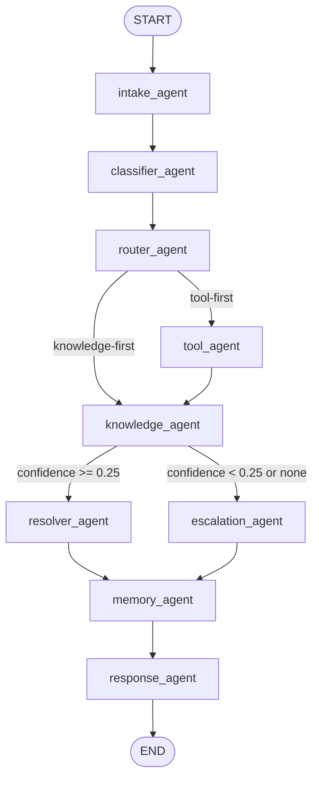

# UDA-Hub Multi-Agent Architecture (LangGraph)

## Pattern
Supervisor-style orchestrated graph with specialized worker agents.

## Agent Roles
1. `intake_agent`
- Validates incoming ticket payload.
- Loads long-term user context from persistent memory.
- Appends message to short-term conversation state.

2. `classifier_agent`
- Classifies ticket category (`login`, `billing`, `subscription`, `reservation`, `technical`, `account`, `general`).
- Infers urgency and complexity from text and metadata.

3. `router_agent`
- Chooses routing path:
  - `tool_agent` first for account/subscription/reservation/billing-style tasks.
  - `knowledge_agent` first for standard informational tasks.

4. `tool_agent`
- Executes support tools that abstract external CultPass DB.
- Tools:
  - Account lookup
  - Reservation lookup
  - Subscription status update (pause/cancel flows)

5. `knowledge_agent`
- Performs retrieval over internal UDA-Hub knowledge table.
- Returns ranked articles and confidence score.

6. `resolver_agent`
- Generates final answer using retrieved article content.
- Includes tool outcome summary and personalization hints from memory.

7. `escalation_agent`
- Triggers if retrieval confidence is below threshold or no relevant article is found.
- Produces escalation summary with reason/category.

8. `memory_agent`
- Persists ticket, metadata, user/assistant messages.
- Stores interaction history and updates long-term memory preferences/recent issues.

9. `response_agent`
- Final output node returning customer-facing response.

## Information Flow

## Memory Design
- Short-term memory:
  - LangGraph `MemorySaver` + `thread_id` preserves state during a session.
  - Conversation history and decision log stay in graph state.

- Long-term memory (persistent):
  - `interaction_history` table stores resolved/escalated interactions.
  - `long_term_memory` table stores preferences, recent issues, last resolution, and resolved count.
  - Used during intake to personalize responses and improve continuity across sessions.

## Retrieval and Confidence
- Retrieval is lexical scoring over title/content/tags from `knowledge` table.
- Confidence = top article score (coverage + tag boost).
- Escalation threshold is `0.25`.

## Logging
- Every node appends structured JSON logs to `solution/data/core/workflow_logs.jsonl`.
- Log payload includes `thread_id`, `ticket_id`, `node`, `event`, and structured details.
